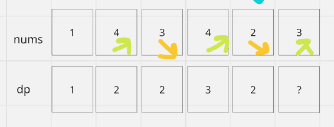

# 동적 계획법: 최장 증가 부분 수열

sample 문제

정렬되지 않은 정수 배열을 입력하고 가장 긴 증가 부분 수열을 찾는다.

```js
nums = [10, 9, 2, 5, 3, 7, 101, 18] 일때,

최장 증가 수열은 [2, 3, 7, 101] 이다.
```

수학적 귀납법으로 생각해보면, dp배열에서 dp[0...i-1]이 계산되었다고 가정하고 어떻게 dp[i]를 도출할 수 있을지 생각해야한다.

| dp배열, dp[i]값의 의미는?

dp[i]는 숫자 nums[i]로 끝나는 `최장 증가 수열의 길이`를 나타낸다.

dp[1]의 초깃값은 1이다. nums[i]로 끝나는 최장 증가 수열은 최소 자신을 포함한다.

dp[0...4]의 모든 결과를 안다고 가정할 때, 이 결과로부터 dp[5]를 어떻게 가져올 수 있을까?



nums[5] = 3이고 증가 부분 수열이므로 앞에서 3보다 작은 수를 찾아 3을 이어 붙이면 새로운 증가 부분 수열을 만들 수 있으며 이때 새로운 수열의 길이에 1이 더해진다.

따라서 아래와 같은 코드가 만들어진다.

```js
for (let j = 0; j < i; j++) {
  if (nums[i] > nums[j]) {
    dp[i] = Math.max(dp[i], dp[j] + 1);
  }
}
```

최종 결과(부분 수열의 최대 길이)는 dp배열의 최댓값이어야 하므로, 아래와 같이 도출할 수 있다.

```js
let res = 0;
for (let i = 0; i < dp.length; i++) {
  res = Math.max(res, dp[i]);
}
return res;
```

[최종 코드](../../leetcode/300.Longest%20Increasing%20Subsequence.md)
